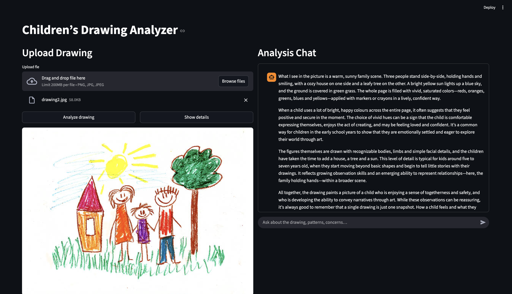
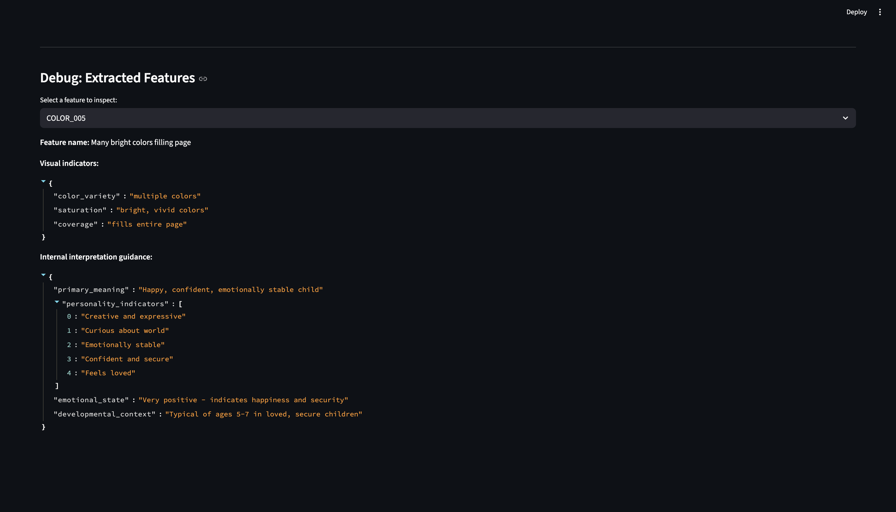

# Children’s Drawing Analyzer

An AI-powered Streamlit application that analyzes children’s drawings to extract visual features and provide psychologically informed interpretations in a **supportive, non-diagnostic** way.

The app uses multiple specialized LLM agents, structured interpretation rules, and optional vector search to explain patterns found in drawings and answer follow-up questions conversationally.

---

## Features

- 🧠 **Feature Extraction Agent**
  - Detects visual elements (e.g., shapes, omissions, patterns) from uploaded drawings
- 📘 **Interpretation Agent**
  - Maps detected features to structured interpretation rules
- 💬 **Chat Agent**
  - Allows interactive follow-up questions about the analysis
- 🔍 **Debug / Transparency Panel**
  - Inspect which rules were triggered and why

---

## Usage Examples

### Upload & Analysis

### Interpretation Output

### Chat Follow-up

### Debug Panel (Rules & Features)

## IMPORTANT — EXPERIMENTAL / TEST PROJECT

This application is a **prototype created for testing and experimentation purposes only**.
It is **not production-ready**, **not validated**, and **not intended for real-world psychological assessment or decision-making**.
All outputs are generated by AI systems and may be inaccurate, incomplete, or misleading.
Do **not** use this tool for clinical, diagnostic, educational placement, or medical purposes.
